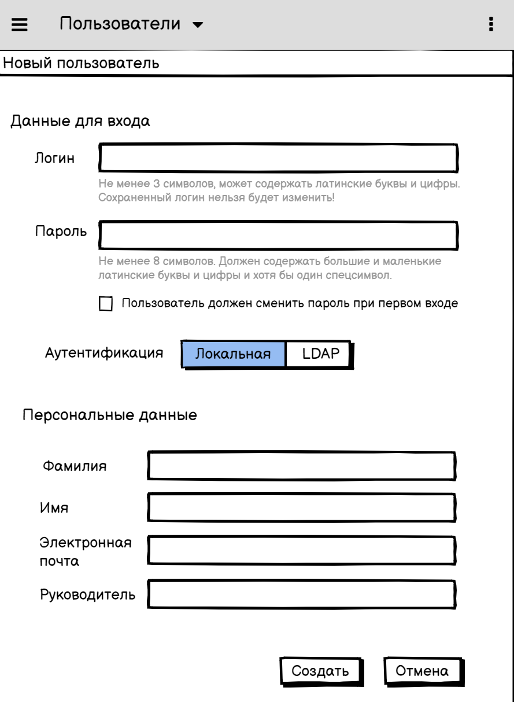
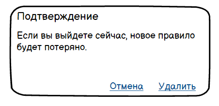
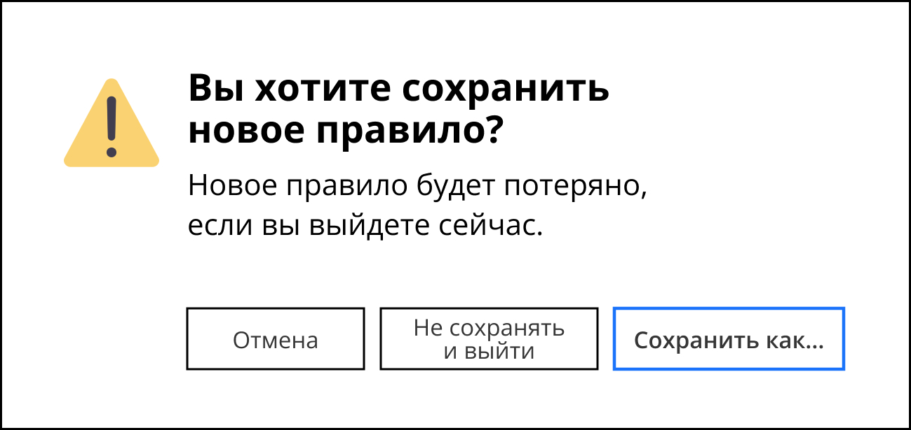

# Тестовое задание

## 1 Стиль технического документа

### 1.1 Коррекция заголовков

**Задание:** Выберите заголовки инструкций, которые нуждаются в редактировании. Объясните свой выбор и напишите вариант правки.

|  Заголовок инструкции | Комментарий и вариант правки |
| :------------- | :------------- |
| Как создать рассылку бюллетеня | Заголовок корректен, если по форме он согласуется с другими заголовками того же уровня или всего документа: *«Как + описание действия»*. Если заголовки того же уровня имеют форму существительного, данный заголовок необходимо изменить так: **Создание рассылки бюллетеня**.   Если инструкция под этим заголовком подходит для рассылки не только бюллетеня, но и других видов документов, заголовок можно обобщить:   **Как создать рассылку** или **Создание рассылки**. |
| Добавление пользователя в систему | **а) Добавление пользователя**    **б) Добавление пользователя в систему SystemName**   «В систему» — либо избыточное указание, либо недостаточно конкретизированное:  – если это заголовок в документе, посвящённом одной системе, то добавление пользователя по умолчанию происходит в эту систему. Тогда словосочетание «в систему» очевидно, и его можно опустить.  – если это заголовок в документе, где описана работа с несколькими системами, в заголовке необходимо указать, добавление в какую из систем описано в этом пункте. |
| Действия в окне **Сканирование** | Заголовок корректен, если в документе описана работа с различными окнами программы, и **Сканирование** — одно из окон.   Если же в документе речь идёт только о сканировании, заголовок можно описать с точки зрения действий пользователя: **Как отсканировать документ**. |
| Настройка дополнительных параметров компонента | Заголовок корректен. |

**Комментарий ко всем заголовкам:** необходимо проверить, чтобы заголовки имели одинаковую форму: *«Как + глагол-описание действия»* (**«Как создать рассылку»**) / *«Существительное-описание действия»* (**«Создание рассылки»**). Выбор формы заголовка может быть описан в рамках стайл-гайда и учитывать SEO-оптимизацию.

 

### 1.2 Коррекция текста

**Задание:** Выберите фрагменты технического текста, которые нуждаются в редактировании. Объясните свой выбор и напишите вариант правки.

|  Фрагмент технического текста | Комментарий и вариант правки |
| :------------- | :------------- |
| База программы велика по размеру(может достигать 200 ГБ), поэтому индексация может занимать достаточно много времени. | **Индексация может занимать 5-20 минут.**   1) «Велика» и «много» — относительные понятия. Более наглядными будут конкретные величины и цифры.   2) Пользователю может быть не важно, какого размера база. Для него важны только детали, которые повлияют на его работу с программой: в данном случае это время ожидания завершения операции. Для удобства пользователя можно указать диапазон времени ожидания: так мы предупредим пользователя о возможных вариантах.    Если пользователь продвинутый и ему доступна информация о размере базы, можно указать размер базы в документации:   **При размере базы в 200 ГБ индексация может занимать 20 минут.**    |
| Красный индикатор сигнализирует о наличии просроченных задач. | Мне не хватает данных для редактирования этого предложения. Мне нужно знать:   – как именно красный индикатор «сигнализирует»? Он появляется? Или он всегда есть, но в случае наличия просроченных задач он начинает мигать?    – где именно должны быть просроченные задачи, чтобы «индикатор сигнализировал»? Вообще существовать в системе? Или быть среди задач в определённом списке / фильтре?|
| Автоматически откроется окно сохранения файла. | В таком виде это предложение малоинформативно, оно нуждается во второй части — условии, при котором окно откроется или дополнительном описании, например:   **а) После (действия А) откроется окно сохранения файла.**   **б) Откроется окно сохранения файла, в котором...**   **в) Откроется окно сохранения файла: (иллюстрация ниже)**   Если нет необходимости подчёркивать, что окно открывается автоматически, слово «автоматически» можно опустить: на то, что окно откроется автоматически, указывает возвратная форма глагола «откроет*ся*».     Если же смысл предложения в том, чтобы указать на то, что окно откроется без дополнительных действий пользователя, можно отредактировать предложение так:   **г) Открывать окно сохранения файла не нужно: оно откроется автоматически.** |
| Конфигурационные файлы программы находятся в папке Product/Configuration. | Для продвинутого пользователя предложение может быть корректным, изменений не нужно. Необходимо проверить корректность пути: возможно, нужно уточнить путь к папке или использовать полный путь вместо относительного — чтобы пользователь точно нашёл нужные конфигурационные файлы. |
| В процессе своей работы программа тщательно опрашивает сеть и получает информацию об активах. | **В процессе работы программа получает информацию об активах, отправляя в сеть множественные запросы.**   Или сократим предложение больше, если подробности о множественных запросах можно опустить, и важен только факт использования сети для получения информации:   **Программа получает информацию об активах из сети.**|
| Программа может создавать инциденты при возникновении на активах некоторых потенциально опасных событий. | **При возникновении потенциально опасных событий программа может создавать инциденты, связанные с активами.**   Мне сложно предложить редактуру: нужно лучше знать контекст работы программы и используемые понятия. Моя правка связана только с порядком слов и использованием предлога. Но возможно, здесь нужна более глубокая редактура. |
| В течение льготного периода вы можете продлить лицензию со скидкой. | В целом предложение корректное. Если можно уточнить размер скидки, отображаем это в предложении:   **В течение льготного периода вы можете продлить лицензию со скидкой 10%.**|
| Вы неверно указали значение в строке IncidentType. Исправьте значение и загрузите конфигурационный файл повторно. | 1) Фраза «вы неверно указали» может быть воспринята как обвинение. Заменим её на обезличенную «значение указано неверно» и укажем, каким должно быть значение, чтобы пользователю было легче устранить ошибку.   2) Вероятно, IncidentType — название поля в коде, оно может быть не видно пользователю. Если это так, нужно заменить IncidentType названием поля, понятным пользователю:  **Тип инцидента указано неверно: необходимо выбрать его из предложенного списка.   Исправьте значение и загрузите конфигурационный файл повторно.** |
| На странице Вредоносное ПО содержится полный список вредоносных программ, известных на текущий момент. | **На странице Вредоносное ПО содержится список вредоносных программ, известных компании К (список обновляется каждые 3 месяца, последнее обновление — 25 января 2023 года).**   1) Составить список «всех известных вредоносных программ» невозможно: разным компаниям известны разные программы. Уточняем, что здесь только список, известный указанной компании.   2) Нужно уточнить, что такое «на текущий момент» — ведь документ будут читать в разное время. |
| Мастер активации осуществляет соединение с сервером активации программы в интернете. | Предложение корректно, если оно сделано в контексте описания работы программы. Чтобы предложить лучший вариант редактуры, необходимо знать контекст: возможно, предложение можно перестроить или исключить, если пользователю не нужно знать особенности работы программы. |
| Подлинность кода активации проверяется на сервере. | Предложение выглядит корректным, если пользователь имеет представление о том, что такое сервер. |
| Программа обладает интуитивно понятным, удобным интерфейсом. В этом разделе мы рассмотрим его основные элементы. |  **Мы подготовили подробную инструкцию о том, как создавать и редактировать правила в Программе П. Вы сможете создать правило за 10 минут. Читайте инструкцию ниже.**   1) Пользователю неинтересны элементы интерфейса сами по себе. Ему интересно узнать, как он сможет решить свои задачи с помощью предлагаемой нами программы. Поэтому заменяем фразу об элементах интерфейса описанием конкретной задачи пользователя.   2) «интуитивно понятный и удобный» — характеристики, которые мы не можем дать нашему интерфейсу: они относительны и неизмеримы. Вместо этого:   – приводим количественные примеры того, как быстро можно выполнять задачи в нашей программе;   – рассказываем о том, что наша статья поможет в освоении программы, так как в ней мы подробно описали шаги освоения. |
| Этот идентификатор характеризует аппаратные характеристики вашего компьютера. Он не содержит вашей личной информации. | **Этот идентификатор описывает технические характеристики вашего компьютера и не содержит вашей личной информации.**   Для более корректной редактуры мне нужно знать контекст предложения и больше информации об идентификаторе. Здесь я исправила только форму предложения. |
| Устанавливая галочки в списке инцидентов, выберите те инциденты, которые не нужно удалять. | Избавляемся от частицы «не» и делаем предложения более короткими:   **В списке отметьте галочками инциденты, которые необходимо сохранить. Остальные инциденты будут удалены.** |

**Комментарий ко всем исправлениям текста:** для редактирования предложений необходимо знать контекст, в котором эти предложения используются. Без знания контекста мне сложно оценить, как нужно отредактировать текст, чтобы эффективно помочь пользователю.

 

## 2 Инструкция

**Задание:** Используя информацию и снимок экрана ниже, напишите инструкцию по добавлению в программу нового пользователя. Инструкция предназначена для администратора программы. Администратор программы не является системным администратором из IT-подразделения компании.
Он – пользователь программы с расширенным набором прав. Знания администратора программы об операционных системах и сетях могут быть невелики.
Администратор программы добавляет пользователя на странице **Новый пользователь**.
Страница доступна из меню программы: **Пользователи > Добавить**. После добавления пользователя администратор назначает ему роль в программе.
Инструкция войдет в Руководство администратора как отдельная статья. Если во время работы у вас появились вопросы или комментарии, добавьте их после инструкции.

# Как добавить нового пользователя

1. Выберите в меню пункты **Пользователи > Добавить**. Появится окно **Новый пользователь**:
 

   
 

2. Введите **Логин** пользователя:
   * он должен иметь длину 3 и более символов,
   * он может состоять из латинских букв и цифр.
  
> Будьте внимательны при заполнении этого поля: **сохраненный логин нельзя будет изменить!**

3. Задайте **Пароль** пользователя, он должен:
   * иметь длину 8 и более символов,
   * содержать большие и маленькие латинские буквы, цифры и хотя бы один спецсимвол (!, @, #...).
4. Поставьте галочку **Пользователь должен сменить пароль при первом входе**, если для данного пользователя вам не даны обратные указания.
5. Выберите тип **Аутентификации**:
   * **Локальная**: используйте для отделов Отдел 1, Отдел 2;
   * **LDAP** (централизованная): используйте во всех остальных случаях.
6. Заполните **Персональные данные пользователя**: **Фамилию**, **Имя**, **Электронную почту** и имя **Руководителя**. Эти данные должны быть предоставлены в заявке от отдела кадров.
7. Проверьте введённые вами данные и нажмите кнопку **Создать**.
8. После добавления пользователя назначьте ему роль в программе, для этого… (далее следует инструкция о том, как назначить роль пользователю).

При возникновении вопросов обратитесь к администратору [@admin123](t.me/admin123) (Telegram).

 

**Комментарии к заданию:**
Нужно уточнить детали к некоторым пунктам, а именно:
1. к полю **Логин**:
     * необходимо уточнить, как в логинах учитывается регистр,
     * необходимо уточнить, как в логинах учитывается регистр. 
2. к галочке **Пользователь должен сменить пароль при первом входе**: узнать и описать подробнее, в каких случаях её не нужно ставить.
3. к полю **Аутентификации**: уточнить список конкретных случаев, когда нужно выбрать тот или иной пункт.
4. к **Персональным данным**: уточнить, где администратор может их взять.
5. к контактам службы поддержки: узнать и описать точнее, к кому обращаться в случае ошибок и возникновении вопросов.
6. к окончанию инструкции: узнать, как назначить роль пользователю, и описать это в инструкции далее.

 
 

## 3 Интерфейсный текст

**Задание:** Прокомментируйте текст сообщения для пользователя ниже. Если необходимо, предложите вариант правки.

**Ошибки и проблемы диалогового окна.** Данное окно может быть неправильно использовано пользователем потому что:

1. Основной текст диалогового окна и тексты кнопок не связаны. Из-за этого пользователю может быть непонятно, что произойдёт при клике на каждую из кнопок.
2. На кнопках отсутствует фокус. Фокус на кнопке **Отмена** помог бы пользователю предотвратить удаление нового правила, если пользователь вызвал это окно по ошибке.

 

**Контекст диалогового окна.** Судя по тексту окна, контекст его использования следующий: в программе происходит создание или изменение нового правила, пользователь нажимает кнопку выхода из программы или из её части, и появляется данное диалоговое окно. В нём описано предупреждение о том, что новое правило будет потеряно при выходе.

* При клике на кнопку **Удалить** новое правило будет потеряно и будет осуществлён выход из программы или из её части.
* При клике на кнопку **Отмена** пользователь вернётся к созданию или редактированию нового правила, выход будет отменён.

Значит, существуют следующие варианты действий:

1. вернуться в программу, в текущий контекст работы;
2. удалить новое правило и выйти;
3. сохранить новое правило и выйти (этот вариант не представлен в диалоге, но он может быть технически доступен в программе).

Отобразим эти кнопки в диалоге.

**Кнопки: расположение и фокус** Расположить кнопки нужно согласно той же логике, которая используется повсюду в программе: кнопка **Отмена** может быть крайней слева или крайней справа, это должно быть отражено в стайлгайде и использоваться во всей программе.
Фокус должен быть на кнопке, которая поможет сохранить новое правило: так мы поможем пользователю сохранить введённые им ранее данные.

**Текст диалога**

* Основным текстом диалога сделаем вопрос о том, какой выбор действий доступен пользователю: «Вы хотите сохранить новое правило?»
* В тексте сообщения ниже предупредим пользователя о возможных последствиях: о потере нового правила в случае выхода.
* Добавим неразрывные пробелы в тексте сообщения: между существительными и относящимися к ним определениям, а также после предлогов.

**Значок предупреждения.** Действия в этом окне может привести к потере данных, введённых пользователем. Значит, нужно привлечь внимание пользователя. Для этого используем яркую иконку с восклицательным знаком.

 

*Диалоговое окно после редактирования*

